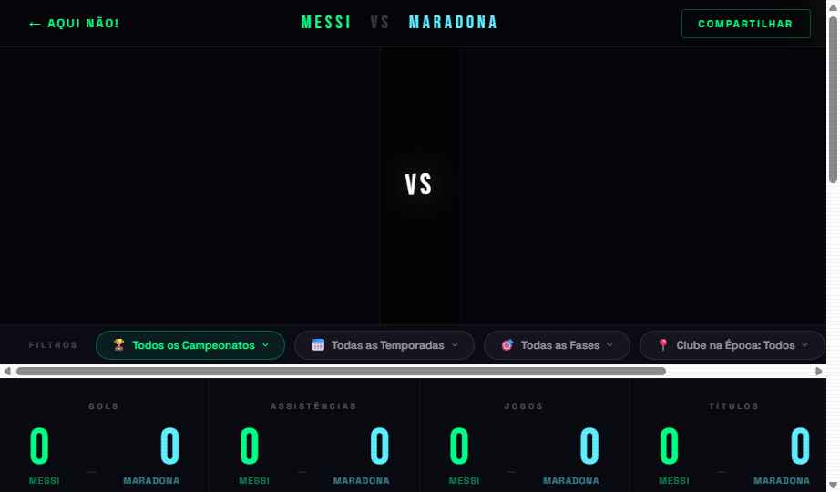

<p align="center">
  
</p>

<h1 align="center">⚽ AQUI NÃO!</h1>

<p align="center">
  <strong>Comparação de carreiras de jogadores de futebol</strong><br>
  <em>Dados reais, debate resolvido.</em>
</p>

<p align="center">
  <a href="#funcionalidades">Funcionalidades</a> ·
  <a href="#preview">Preview</a> ·
  <a href="#instalação">Instalação</a> ·
  <a href="#uso">Uso</a> ·
  <a href="#tecnologias">Tecnologias</a>
</p>

---

## Funcionalidades

- **Busca em tempo real** — digite o nome e veja jogadores com nome, nacionalidade e clube
- **Comparação completa** — gols, assistências, jogos, minutos, lesões e títulos
- **Gráficos interativos** — evolução por temporada, comparação por idade, projeção de carreira
- **Duelos épicos** — Mess vs Maradona, Pelé vs Maradona, CR7 vs Messi com um clique
- **Troca de jogadores** — mude os jogadores direto na tela de comparação
- **Dados de múltiplas fontes** — FBref, Transfermarkt e Football-Data.org

## Preview

<p align="center">
  
</p>

<p align="center">
  
</p>

## Instalação

```bash
# Clone o repositório
git clone https://github.com/saironbusatto/Aqui_nao.git
cd Aqui_nao

# Instale as dependências
pip install -r requirements.txt
```

## Uso

```bash
# Inicie o servidor
cd src
python3 -m flask --app app run

# Acesse
# http://localhost:5000
```

## Testes

```bash
# Execute todos os testes
python3 -m pytest tests/ -v

# Com cobertura
python3 -m pytest tests/ --cov=src --cov-report=term-missing
```

## Tecnologias

| Camada | Tecnologia |
|--------|-----------|
| Backend | Python + Flask |
| Frontend | HTML/CSS/JS vanilla + Chart.js |
| Dados | soccerdata (FBref), requests+bs4 (Transfermarkt), football-data.org |
| Testes | pytest + pytest-cov |
| Design | Tema dark neon (Aqui Não! Design System) |

## Estrutura

```
src/
├── app.py                  # Rotas Flask + banco de jogadores
├── collectors/             # Coletoras de dados externos
├── models/                 # Dataclasses imutáveis (Player, Comparison)
├── services/               # Lógica de negócio (comparação, projeção, relatório)
├── utils/                  # Cache e helpers
├── templates/              # Home + Compare (tema dark neon)
└── static/css/             # Estilos customizados
```

## Licença

MIT

---

<p align="center">
  Feito com ⚽ por <a href="https://github.com/saironbusatto">saironbusatto</a>
</p>
